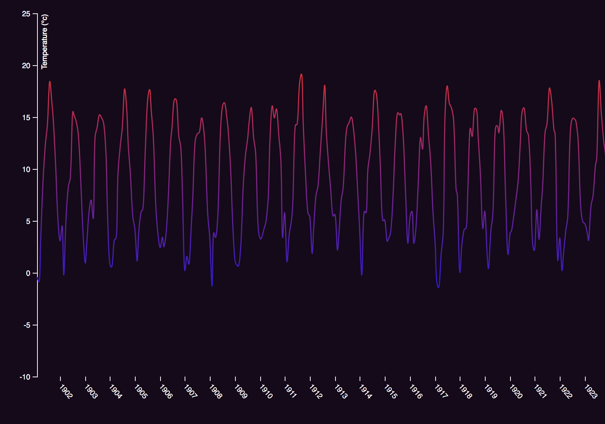

# Assessment 1 - Lucas Berghoef

In assessment 1 I've made a basic visualisation from the given data "Homogenised monthly temperature time series of De Bilt (1901-present)".



## Background
Assessment 1 tests that I’ve attained the following knowledge:

* SVG and canvas
* Load external data
* Read and write docs
* Debug and refactor code
* Use scales

## Data

### Monthly temperature time series

Homogenised monthly temperature time series of De Bilt (1901-present).  Cleaned
from [`knmi.nl`][temperature-source].

###### Format

Comma-separated values (CSV) with 1400 rows and two columns:

*   `date` — Date in `YYYYMMDD`
*   `temp` — Homogenised monthly temperature in degrees celsius

###### Example

```csv
date,temp
19010131,-0.424
19010228,-0.761
19010331,3.369
19010430,8.782
19010531,12.181
...
20170430,8.44
20170531,14.854
20170630,17.926
20170731,17.828
20170831,17.131
```

## Features
* [d3.select](https://github.com/d3/d3-selection/blob/master/README.md#selection_select) - Selects the first element that matches the specified selector string.
* [d3.timeParse](https://github.com/d3/d3-time-format#timeParse) - An alias for locale.parse on the default locale.
* [d3.timeYear](https://github.com/d3/d3-time#timeYear) - Helps set the ticks of an axis to every year.
* [d3.scaleTime](https://github.com/d3/d3-scale#scaleTime) - Constructs a new time scale with the domain [2000-01-01, 2000-01-02], the unit range [0, 1], the default interpolator and clamping disabled.
* [d3.scaleLinear](https://github.com/d3/d3-scale#scaleLinear) - Constructs a new continuous scale with the unit domain [0, 1], the unit range [0, 1], the default interpolator and clamping disabled.
* [d3.line](https://github.com/d3/d3-shape/blob/master/README.md#line) - Constructs a new line generator with the default settings.
* [d3.csv](https://github.com/d3/d3-request/blob/master/README.md#csv) - Returns a new request for the CSV file at the specified url with the default mime type text/csv.
* [d3.extent](https://github.com/d3/d3-array/blob/master/README.md#extent) - Returns the minimum and maximum value in the given array using natural order.
* [d3.axisBottom](https://github.com/d3/d3-axis#axisBottom) - Constructs a new bottom-oriented axis generator for the given scale, with empty tick arguments, a tick size of 6 and padding of 3. In this orientation, ticks are drawn below the horizontal domain path.
* [d3.axisLeft](https://github.com/d3/d3-axis#axisLeft) - Constructs a new left-oriented axis generator for the given scale, with empty tick arguments, a tick size of 6 and padding of 3. In this orientation, ticks are drawn to the left of the vertical domain path.
* [d3.curveCatmullRom](https://github.com/d3/d3-shape/blob/master/README.md#curveCatmullRom) - Produces a cubic Catmull–Rom spline using the specified control points and the parameter alpha, which defaults to 0.5.

## Process

### Step 1. Setting up the documents.
I started by getting the data from GitHub, I chose "Homogenised monthly temperature time series of De Bilt (1901-present)". After that I chose my basic D3 Line Chart from Mike Bostock and changed the TSV reference to link to the CSV file I made with the data.

### Step 2. Changing object variable "close" to "temp".
The original code didn't recognize part of the data in my CSV file because it was named "temp" instead of "close". I also removed "d.close = +d.close;" because it didn't do anything.  So I changed this:
```js
var line = d3.line()
    .x(function(d) { return x(d.date); })
    .y(function(d) { return y(d.close); });

d3.tsv("data.tsv", function(d) {
  d.date = parseTime(d.date);
  d.close = +d.close;
  return d;
}, function(error, data) {
  if (error) throw error;
```
To this:
```js
var line = d3.line()
    .x(function (d) { return x(d.date); })
    .y(function (d) { return y(d.temp); });

d3.csv("index.csv", function (d) {
    d.date = parseTime(d.date);
    return d;
}, function (error, data) {
    if (error) throw error;
```

### Step 3. Changing the "timeParse" function.
The dates didn't get recognized because the "timeParse" function didn't know the correct notation in the data. So I changed this:
```js
var parseTime = d3.timeParse("%d-%b-%y");
```
To this:
```js
var parseTime = d3.timeParse("%Y%m%d");
```

### Step 4. Making the data readable in the graph.
The line in the graph was too condensed because of the scale. So I changed this:
```js
y.domain(d3.extent(data, function(d) { return d.close; }));
```
To this:
```js
 y.domain([-10.0, 25.0]);
```
And also changed the width and height of the SVG in the "index.html" from this:
```html
<svg width="960" height="500"></svg>
```
To this:
```html
<svg width="4000" height="540"></svg>
```

### Step 5. Styling the SVG
Now it's time to style the chart!

| File      | Line(s) | Change                                                                                        | 
| -----     | -----   | -----                                                                                         |
| index.css | 2       | Made the background dark purple in the "index.css"                                            |
| index.js  | 100-105 | Changed the color of the fill, text, line, stroke and path elements to white.                 |
| index.js  | 53      | Added a curve to the line to make it smoother with `d3.curveCatmullRom`                       |
| index.js  | 15-34   | Added vertical gradient to the line so it's easier to distinguish warm from cold temperatures |
| index.js  | 75      | Changed the "ticks" of the x-axis to show every year, instead of every 10 years               |

## License

MIT © Lucas Berghoef